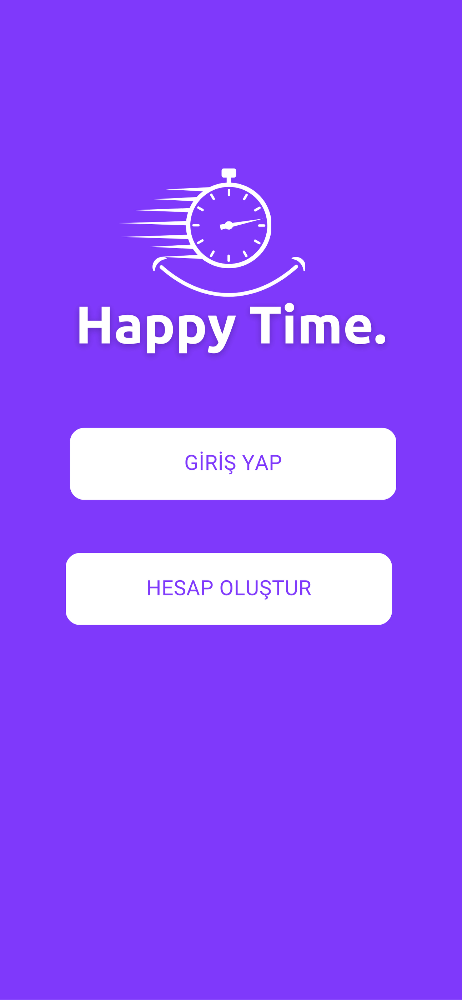
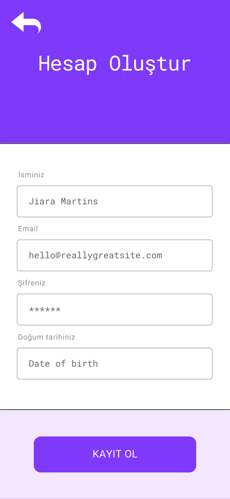
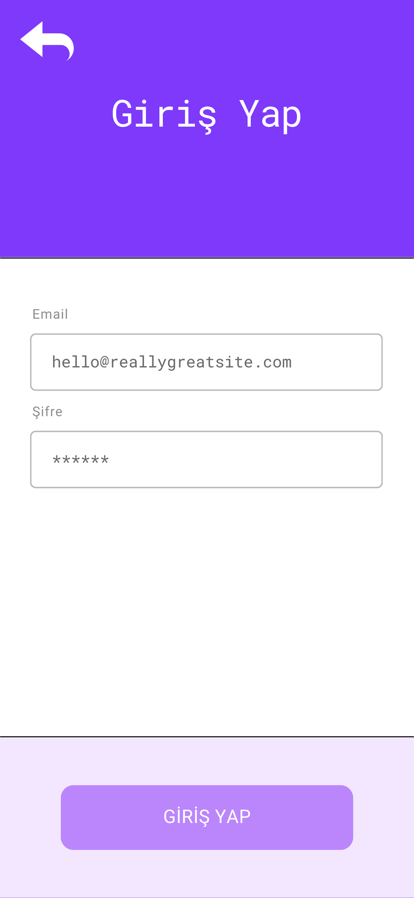
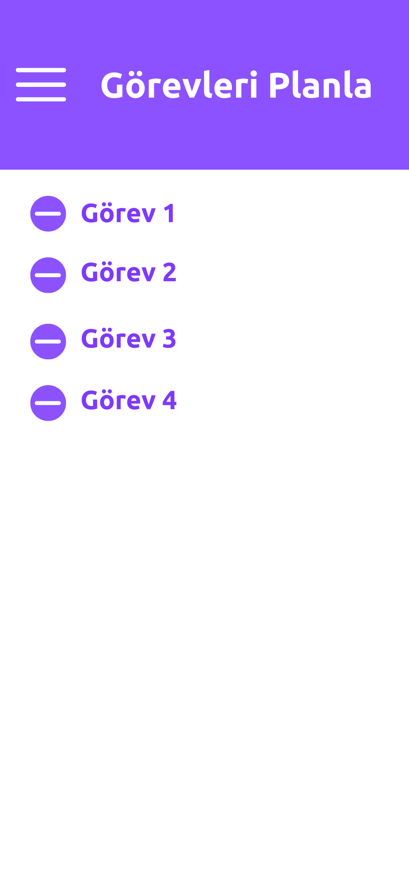
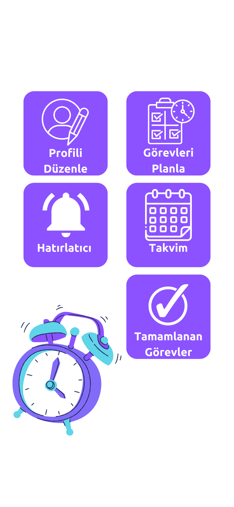
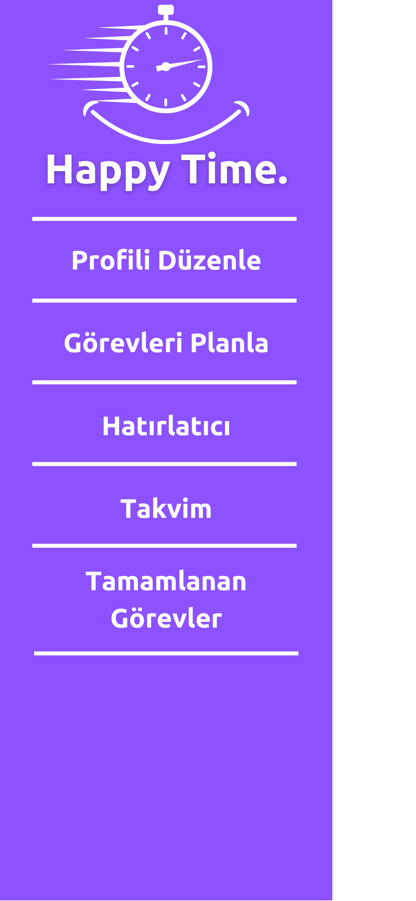
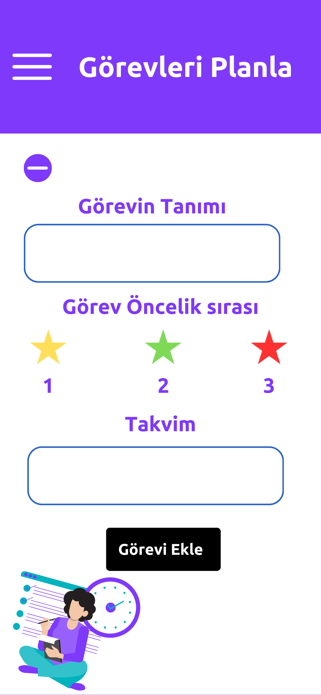
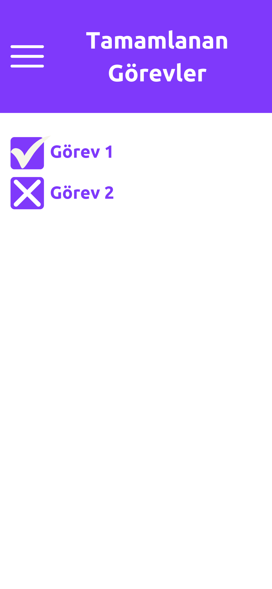

# Takım ve Ürün Adı

Flutter47 - Happy Time

## Takım ve Ürün Hakkında Bilgiler

**Takım Üyeleri**

Beyza Yaylak * Scrum Master
Ece Kara * Product Owner
Berkay Pekersoy * Developer
Beyzanur Kuzhan * Developer
Bora Baştür * Developer

## Ürün Açıklaması

Günlük, Haftalık ve Aylık Görev Planlayıcı ve Hatırlatıcı Uygulaması
Günlük yaşamınızı düzenlemek ve zamanınızı verimli bir şekilde yönetmek artık çok daha kolay! Yeni Görev Planlayıcı ve Hatırlatıcı Uygulamamız, günlük, haftalık ve aylık görevlerinizi planlamanıza ve zamanında hatırlatıcılar almanıza yardımcı olur.

*Başlıca Özellikler:*

Görev Ekleme: Hızlı ve kolay bir şekilde günlük, haftalık ve aylık görevlerinizi ekleyin.
-Tamamlanmış Görevleri İşaretleme: Tamamladığınız görevleri işaretleyerek ilerlemenizi takip edin.
-Hatırlatıcılar Kurma: Görevleriniz için kişiselleştirilmiş hatırlatıcılar kurun ve hiçbir şeyi kaçırmayın.
-Kullanıcı Dostu Arayüz: Basit ve sezgisel tasarımı sayesinde herkes tarafından kolayca kullanılabilir.
-Organize Olmayı Kolaylaştırır: Görevlerinizi düzenli bir şekilde takip ederek hayatınızı daha verimli hale getirin.

Bu uygulama, yoğun iş temposu olan profesyonellerden öğrencilere kadar herkes için mükemmel bir çözüm sunar. Organize olun, zamanınızı daha iyi yönetin ve görevlerinizi tam zamanında tamamlayın. Hayatınızı kolaylaştırmak ve verimliliğinizi artırmak için Görev Planlayıcı ve Hatırlatıcı Uygulamamızı hemen deneyin!

**Ürün Özellikleri**

**Görev Planlayıcı ve Hatırlatıcı Uygulamamızın Hedef Kitlesi**

*Öğrenciler:*
Ders programlarını, ödev teslim tarihlerini ve sınav tarihlerini takip etmek zorunda olan öğrenciler için ideal bir araçtır. Günlük, haftalık ve aylık görev planlayıcıları sayesinde çalışmalarını organize edebilir, hatırlatıcılar sayesinde hiçbir şeyi kaçırmazlar.

*Ev Hanımları ve Ev İşi Yapanlar:*
Ev işleri, çocukların etkinlikleri ve kişisel görevleri arasında denge kurmaya çalışan ev hanımları ve ev işi yapanlar için mükemmel bir çözüm sunar. Günlük ev işleri, alışveriş listeleri ve diğer aile ile ilgili görevleri düzenleyerek hayatınızı daha kolay hale getirir.

*Serbest Çalışanlar ve Girişimciler:*
Projeler, müşteri toplantıları ve kişisel görevler arasında denge kurmak zorunda olan serbest çalışanlar ve girişimciler için vazgeçilmez bir yardımcıdır. Görevlerinizi organize ederek ve hatırlatıcılar kurarak işlerinizi daha verimli bir şekilde yönetebilirsiniz.

*Yoğun Sosyal Hayatı Olanlar:*
Sosyal etkinlikler, doğum günleri ve özel günler arasında denge kurmak isteyenler için ideal bir araçtır. Hatırlatıcılar sayesinde hiçbir önemli etkinliği veya tarihi kaçırmazsınız.

*Zaman Yönetimi ve Kişisel Gelişim Meraklıları:*
Zaman yönetimini ve kişisel verimliliği artırmak isteyenler için mükemmel bir araçtır. Görevlerinizi planlayarak ve düzenli hatırlatıcılar alarak kişisel hedeflerinize daha kolay ulaşabilirsiniz.

This project is a starting point for a Flutter application.

A few resources to get you started if this is your first Flutter project:

- [Lab: Write your first Flutter app](https://docs.flutter.dev/get-started/codelab)
- [Cookbook: Useful Flutter samples](https://docs.flutter.dev/cookbook)

For help getting started with Flutter development, view the
[online documentation](https://docs.flutter.dev/), which offers tutorials,
samples, guidance on mobile development, and a full API reference.

    
<h1>Sprint 1</h1>

    
<h3>Sprint 1 - App Screenshots</h3>

  <table style="width: 100%;">
    <tr>
      <td colspan="4" style="text-align: center;"><h2>Kullanıcı Doğrulama Sayfaları</h2></td>
    </tr>
    <tr>
      <td style="width: 25%;"></td>
      <td style="width: 25%;"></td>
      <td style="width: 25%;"></td>
    </tr>
    <tr>
      <td colspan="4" style="text-align: center;"><h2>Ana Ekran ve Görevler Sayfası</h2></td>
    </tr>
    <tr>
      <td style="width: 25%;"></td>
      <td style="width: 25%;"></td>
      <td style="width: 25%;"></td>
    </tr>
    <tr>
      <td colspan="4" style="text-align: center;"><h2>Görev Ekleme ve Görevler Sayfası</h2></td>
    </tr>
    <tr>
      <td style="width: 25%;"></td>
      <td style="width: 25%;"></td>
    </tr>
  </table>
  
   

  

    
<h3>Sprint 1 - Sprint Board Update Screenshots</h3>

    
    
  

  

    
<h3>Sprint 1 - Proje Takip Aracı</h3>

    
    
    
    
    
    
    
  

  - **Sprint Notes**:
    "İlk sprint sürecinde görev dağılımı yapıldı. Herkesten kod yazması istenmesi üzerine görevlerde ortak payda sağlanarak herkesin olağan uygunluk durumuna göre yapabilirlik seviyesine göre görevlerde rol alması sağlandı.
İlk olarak tasarımın canvada yapılmasına karar verildi.
email login sisteminin kullanılmasına karar verildi."

  - **Sprint içinde beklenen puan tamamlama**: 200 puan
  - **Puan Tamamlama Mantığı**: `(200 points completed)` Ekibin iş yoğunlu, okul durumu olsada görevler tamamlanmaya çalışıldı.
  - **Daily Scrum**: "Beyza Yaylak görev takibinin kolay bir şekilde yapılması için  google sheet oluşturdu. 
Ürün fikri bulmak için ekip üyelerinden fikir düşünme ve paylaşma adına süre belirlendi.
Toplam Ece, Beyzanur Kuzhan ve Berkay'ın eklemiş olduğu dört fikir üzerinden yapılabilirlik ve zaman kapsamında hangisinin uygun olabileceği paydaları da değerlendirilerek oylamalar yapıldı ve uygulama fikrine karar verildi.   
 Elde edilen fikir için taslak bir uygulama şeması Beyzanur Kuzhan  tarafından oluşturuldu.
Ardından Canva tarafında uygulama arayüzü üzerine Beyza Yaylak ve Berkay çalıştı.
Beyza Yaylak logoyu ve uygulama ismi üzerinde çalıştı.
İlk sprint için istenilen düzeye getirildi.
Kodlama kısmında başlangıç ve sayfalar oluşturulmaya başlandı. 
Bora yaptığımız çalışmaların githup repoya aktarılması konusunda Beyza Yaylak ve Berkay'a destek oldu.
Genel olarak iyi bir sprint süreci geçirdiğimizi düşünüyoruz. İş tempomuz olsa da zamanı iyi kullandığımızı düşünüyoruz.
"
  - **Product Backlog URL:** 
  - **Sprint Review:**
    Ürün değerlendirme sürecinde; Tasarım için Beyza Yaylak ve Berkay koordineli bir süreç yürüttüler. Proje seçme konusunda zorlanma olmadı. Fakat projeye isim konusuna ayrılan zaman tahminimizden daha uzun sürdü. 

  - **Sprint Review Participants:** Beyza Yaylak, Ece Kara, Berkay Pekersoy, Bora Baştürk, Beyzanur Kuzhan 
  - **Sprint Retrospective:**
    "İkinci sprintte uygulamaya yoğunlaşılmasına karar verildi.
Berkay, Beyzanur ve Bora’nın uygulamanın kod kısmına yoğunlaşmasına karar verildi. 
Arayüz tasarımında Beyza ve Ece’nin hazırlayıp geliştirici arkadaşlara iletmesine karar verildi.
"

  - **Other Notes**:
  

    
<h3>Additional Files</h3>

    <ul>
      <li><strong>Project Scope And Goals:</strong> <a href="./bootcampFiles/sprintOne/projectscopeandgoals.pdf">See file</a></li>
      <li><strong>Target Audience:</strong> <a href="./bootcampFiles/sprintOne/targetaudience.pdf">See file</a></li>
      <li><strong>Conversations:</strong> See file</li>
    </ul>
  

  

